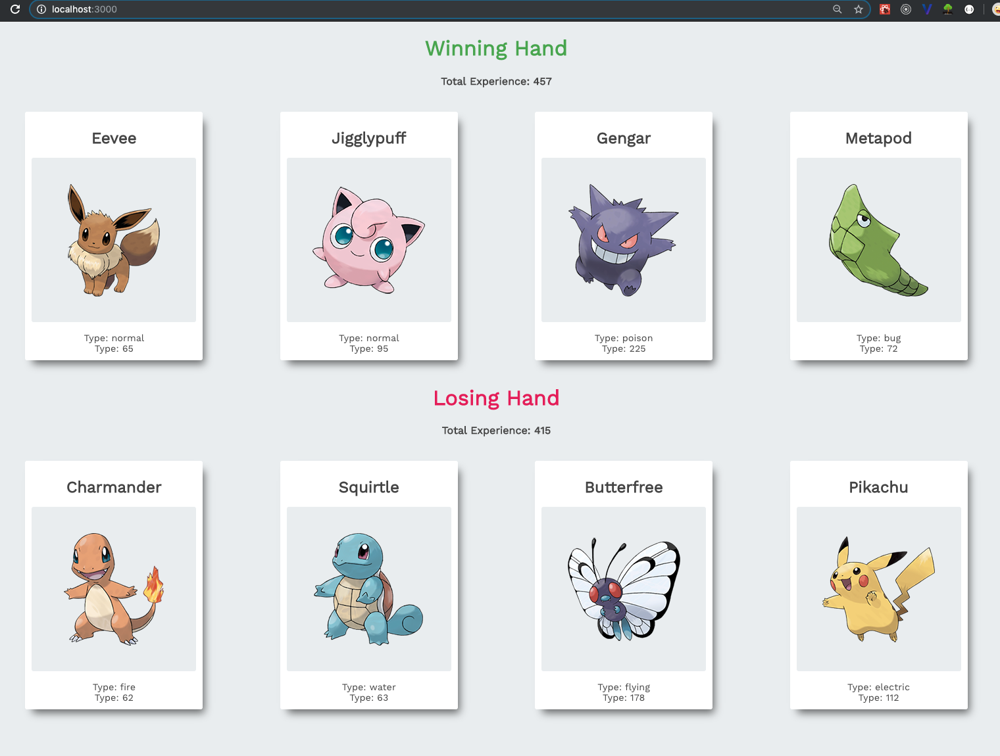

# Pokemon game built with React

A Pokemon game, where refreshing the page will give give two hands with four pokemons each, calculating the hands total score and decide a winner. 
React class based components are used and props to set properties.

## Using create-react-app

The project was initialized with create-react-app, [Create React App](https://github.com/facebook/create-react-app)

# Instructions to run the application

Run these commands in the project directory: 
Installing dependencies 
`$ npm install`

Starting the application in development mode 
`$ npm start`

This should open the application in the browser, otherwise go to: 
[http://localhost:3000](http://localhost:3000) 
The page will reload if you make code edits.

# Screenshots

Pokemon game

## Author

- Albert Stjärne (https://github.com/AlbertStjarne)
